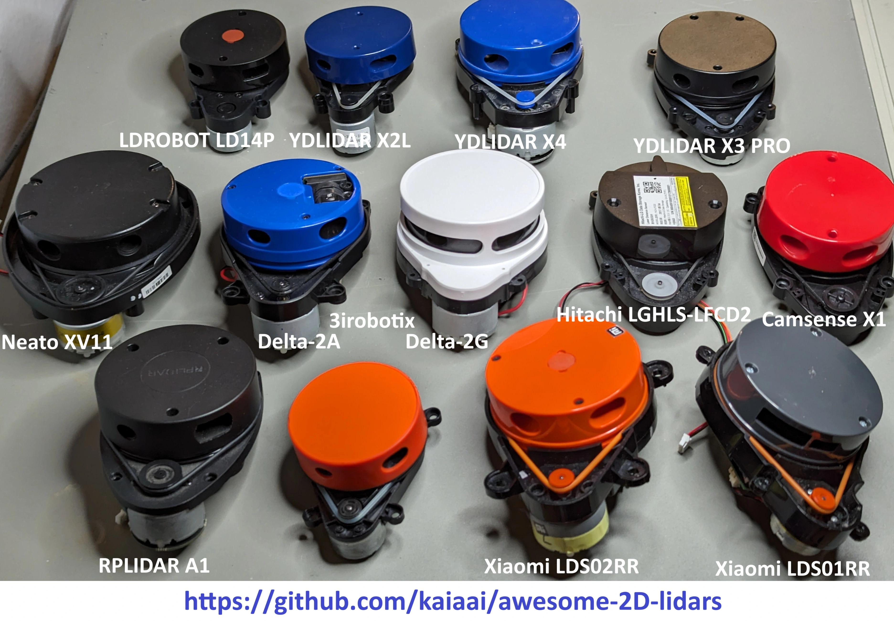
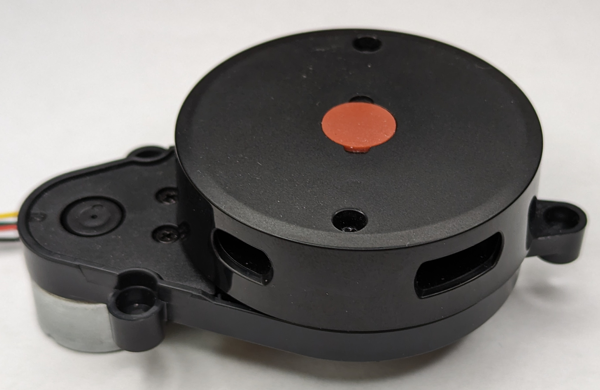
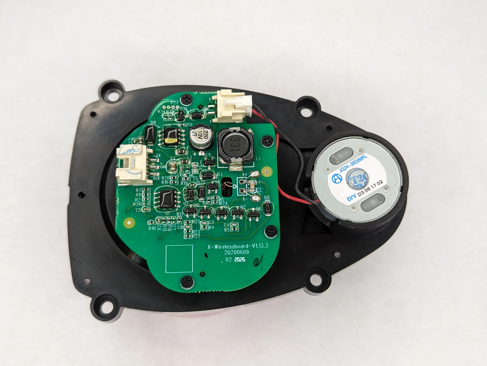
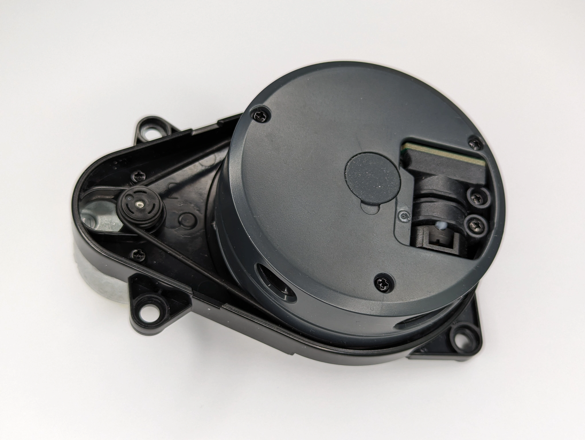
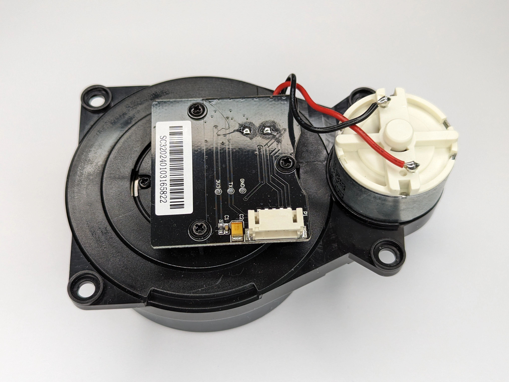

Awesome 2D (low-cost) LiDAR list - specs, protocols, identification photos/videos, wiring, code, model versions, performance (TODO)

Please note - some of the information in the table below may be incorrect.
- some LiDAR/LDS models do not have official datasheets available publically 🫤
- some LiDAR/LDS models evolve over time - their specs change, while the model name remains unchanged
- maximum distance specification is often poorly defined (needs object reflectivity and ambient illumination specified)
- ambient light resistance is often poorly defined as well (needs object reflectivity, distance to object and ambient light spectrum)

Please also see this [blog post](https://kaia.ai/blog/arduino-lidar-library/) and [library](https://github.com/kaiaai/LDS).

## Comparison Table

| Model                | Type | Scans per sec | Points per sec | Range, Meters |   Accuracy    | Price Retail | Service Life | Safety | Max Ambient, Lux | Laser w/len | Weight | Temp. Range | Links |
|----------------------|------|---------------|----------------|---------------|---------------|--------------|--------------|--------|------------------|-------------|--------|------------|-------|
| YDLIDAR X4           | Tria |  6-12Hz | 5KHz    | 0.12-10 | | ~$70-90  |         | Class 1 | 2K     | 793nm | 180g | | [PDF](https://www.ydlidar.com/Public/upload/files/2024-02-01/YDLIDAR%20X4%20Data%20sheet%20V1.2(240125).pdf) |
| YDLIDAR X4 PRO       | Tria |  6-12Hz | 5KHz    | 0.12-10 | | ~$75-100 | 1,500h  | Class 1 | 40K    | 793nm | 178g | | [PDF](https://www.ydlidar.com/Public/upload/files/2024-02-01/YDLIDAR%20X4PRO%20Datasheet%20V1.1%20(240124).pdf) |
| YDLIDAR X2/X2L       | Tria |  5-8(6)Hz | 3KHz | 0.12-8@80% | | ~$75-100 | 1,500h | Class 1 | 2K  | 793nm | 126g | | [PDF](https://www.ydlidar.com/Public/upload/files/2024-02-01/YDLIDAR%20X2%20Data%20Sheet%20V1.2(240124).pdf) |
| YDLIDAR X3           | Tria |  5-10(8)Hz | 3KHz | 0.12-8  | | ~$65     |         | Class 1 | 2K    | 793nm | 135g | |      |
| YDLIDAR X3 PRO       | Tria |  6-12Hz | 4KHz    | 0.12-8  | | ~$70     | 1,500h  |         | 40K   |       |      | | [Datasheet](https://static.generation-robots.com/media/YDLIDARX4PRODatasheet.pdf) |
| YDLIDAR G1           | Tria |  5-12(7)Hz | 4-9KHz  | 0.12-8@80% |  | |         | Class 1 | 20K    | 793nm | 140g | | [Product](https://www.ydlidar.com/products/view/13.html) |
| YDLIDAR G2           | Tria |  5-12(7)Hz | 5KHz | 0.12-16@80% |    | |         | Class 1 | 2K     | 792nm | 185g | | [Product](https://www.ydlidar.com/products/view/1.html) |
| YDLIDAR G4           | Tria |  5-12(7)Hz | 9KHz | 0.12-16@80% |    | |         | Class 1 | 2K     | 792nm | 214g | | [Product](https://www.ydlidar.com/products/view/3.html) |
| YDLIDAR G6           | Tria |  5-12(7)Hz | 10-18(18)KHz | 0.12-16@80% | | |   | Class 1 | 2K     | 792nm | 214g | | [Product](https://www.ydlidar.com/products/view/4.html) |
| YDLIDAR SCL          | Tria |            |              |             | | |   |         |        |       |      | | [Arduino code](https://github.com/kaiaai/LDS) |
| YDLIDAR T-mini Plus  | ToF  |  6-12(6)Hz | 4KHz    | 0.05-4m@10%-12m@80% | 20mm | $71 |   | Class 1 | 60K | 905nm | 45g | | [Product](https://www.ydlidar.com/products/view/27.html) |
| YDLIDAR T-mini Pro   | ToF  |  6-12(6)Hz | 4KHz    | 0.02-4m@10%-12m@80% | 20mm |     |   | Class 1 | 60K | 905nm | 45g | | [Product](https://www.ydlidar.com/products/view/22.html) |
| XIAOMI LDS02RR       | Tria |   5Hz   | 1.8KHz  | 0.15-6  | | ~$16     |         |         |        |       |      | | Uses Neato protocol |
| XIAOMI LDS01RR       | ToF  |   5Hz   |         | 0.15-9  | | ~$37     | 1,095h  | Class 1 |        |       |      | | [Spec](https://www.youyeetoo.com/blog/lds01rr-lidar-stdps01rmain-108) [ROS2, Win](https://github.com/iliasam/LDS01RR_lidar/tree/main) |
| Neato XV11           | Tria |   5Hz   | ~2KHz   | 0.15-6? | | ~$35     |         |         |        |       | 195g | | [ROS2](https://github.com/mjstn/xv_11_driver) [Char](https://www.diva-portal.org/smash/get/diva2:995686/FULLTEXT01.pdf) |
| SLAMTEC RPLIDAR A1M8-R4 | Tria |  1-10Hz | 8KHz | 0.15-6  | |          |         | Class 1 |        |       |      | | [PDF](https://www.slamtec.ai/wp-content/uploads/2023/11/LD108_SLAMTEC_rplidar_datasheet_A1M8_v3.0_en.pdf) |
| SLAMTEC RPLIDAR A1M8-R5 | Tria |  1-10(5.5)Hz | 8KHz | 0.15-12 | | ~$99     |         | Class 1 |        | 785nm | 170g | | [PDF](https://www.slamtec.ai/wp-content/uploads/2023/11/LD108_SLAMTEC_rplidar_datasheet_A1M8_v3.0_en.pdf) |
| SLAMTEC RPLIDAR A2M12 | Tria |  5-15(10)Hz | 16KHz | 0.2-10B-12W | |         |         | Class 1 |        | 785nm |      | | [Product](https://www.slamtec.ai/product/slamtec-rplidar-a2/) |
| SLAMTEC RPLIDAR C1M1-R2 | ToF* | 8-12(10)Hz | 5KHz | 0.05-6@10%-12@70% | | |      | Class 1 | 40K | 905nm | 110g | | [Product](https://www.slamtec.ai/product/slamtec-rplidar-c1/) |
| SLAMTEC RPLIDAR A3M1 | Tria | 5-15(10)Hz | 16KHz | 0.2-10B-25W | | |      | Class 1 | | 785nm |      | | [Product](https://www.slamtec.ai/product/slamtec-rplidar-a3/) |
| SLAMTEC RPLIDAR S1 | ToF | 8-15(10)Hz | 9.2KHz | 0.1-10B-40W | | |      | Class 1 | | 905nm |      | | [Datasheet](https://wiki.slamtec.com/display/SD/Overseas+Help+Center?preview=/83066883/83066894/LD601_SLAMTEC_rplidar_datasheet_S1_v1.7_en.pdf) |
| SLAMTEC RPLIDAR S2 | ToF | 8-12(10)Hz | 5KHz | 0.05-6@10%-12@70% | | |      | Class 1 | 40K | 905nm | 110g | | [Product](https://www.slamtec.ai/product/slamtec-rplidar-s2/) |
| SLAMTEC RPLIDAR S3 | ToF | 10-20(10)Hz | 32KHz | 0.05-5@2%-15@10%-40@70% | | |      | Class 1 | 80K | 905nm | 115g | | [Product](https://www.slamtec.ai/product/slamtec-rplidar-s3/) |
| 3irobotics Delta-2A  | Tria | ~5.25Hz?| ~1.9KHz?| 0.15-5? | | ~$28     |         |         | 1K?    | |      | | [SDK](https://github.com/CWRU-AutonomousVehiclesLab/Delta-2B-Lidar-SDK) [Protocol](https://github.com/NotBlackMagic/Delta-2G-LiDAR-Driver/blob/master/Documents/Delta-1A%20EN.pdf) |
| 3irobotics Delta-2B  | Tria | 4..10Hz?|  5KHz?  | 0.2..8? | |      |         |         | 1K?    | |      | | [Arduino code](https://wiki.iarduino.ru/page/delta-2b-lidar-esp32/) |
| 3irobotics Delta-2G  | Tria | ~5.25Hz?| ~1.9KHz?| 0.15-5? | | ~$17 |         |         |        | |      | | [SDK](https://lidar.oss-cn-beijing.aliyuncs.com/Lidar.rar) [Protocol](https://github.com/NotBlackMagic/Delta-2G-LiDAR-Driver/blob/master/Documents/Delta-1A%20EN.pdf) |
| Hitachi-LG HLS-LFCD2 | ToF  |   5Hz   | 1.8KHz  | 0.12-3.5| | ~$28 |         | Class 1 | 10K?   | |      | | [Spec](https://emanual.robotis.com/docs/en/platform/turtlebot3/appendix_lds_01/) [ROS2](https://github.com/ROBOTIS-GIT/hls_lfcd_lds_driver) |
| Hitachi-LG HLS-LFCD3 | Tria |   5Hz   | 2.3KHz  | 0.16-8  | | ~$17 | 1,000h  | Class 1 | 25K?   |       |      | | [Spec](https://emanual.robotis.com/docs/en/platform/turtlebot3/appendix_lds_02/) [ROS2](https://github.com/ROBOTIS-GIT/ld08_driver) |
| LDROBOT LD14         | Tria | 2..8(6)Hz  | 2.3KHz  | 0.15-5@4%-8@80% | |         | 1,500h  | Class 1 | 30K?   | 793nm | 131g | | [Datasheet](https://robu.in/wp-content/uploads/2022/12/LD14.pdf) |
| LDROBOT LD14P        | Tria | 2..8(6)Hz  | 4KHz    | 0.1-6@4%-8@80%  | | ~$35    | 2,200h  | Class 1 | 80K?   | 793nm | 100g | | [Datasheet](https://www.ldrobot.com/images/2023/03/02/LDROBOT_LD14P%20DataSheet_CN_v0.4_Wlmrp6QT.pdf) [Spec Protocol](https://www.waveshare.com/wiki/D200_LiDAR_Kit) |
| LDROBOT LD08         | Tria | 2..10Hz | 2.3KHz  | 0.16-8  |                 |         |         | Class 1 | 25K?   | | 131g | | [Datasheet](https://www.ldrobot.com/images/2023/03/02/LDROBOT_LD08_Datasheet_CN_V1.3_aoMhAtqQ.pdf) |
| LDROBOT LD-AIR | ToF? | 5..13Hz | 4.5KHz  | 0.02-12 | ±45mm            | $129 | 10K hrs | Class 1 | 20K   | | 47g | | [Kickstarter 2021](https://www.kickstarter.com/projects/ldrobot/ld-air-lidar-360-tof-sensor-for-all-robotic-applications), [Indiegogo](https://www.indiegogo.com/projects/ld-air-lidar-tof-sensor-for-robotic-applications--3#/), [Driver](https://github.com/Myzhar/ldrobot-lidar-ros2) |
| LDROBOT LD19 | ToF | 10Hz | 4.5KHz  | 0.02-12 | 10mm 3..12m            | | 10K hrs | Class 1 | 30K | | | | [Docs,SDK](https://www.waveshare.com/wiki/DTOF_LIDAR_LD19), [Driver](https://github.com/Myzhar/ldrobot-lidar-ros2) |
| LDROBOT LD06 | ToF | 5..13(10)Hz | 4.5KHz  | 0.02-12 | 15mm            | $99 | 10K hrs | Class 1 | 25K   | 905nm | | | [Docs](https://www.inno-maker.com/product/lidar-ld06/), [Driver](https://github.com/Myzhar/ldrobot-lidar-ros2) |
| LDROBOT LD19P        | Tria | 2..10Hz | 2.3KHz  | 0.16-8  |                 |         |         | Class 1 | 25K?   | | 131g | | [Datasheet](https://www.ldrobot.com/images/2023/03/02/LDROBOT_LD08_Datasheet_CN_V1.3_aoMhAtqQ.pdf) |
| LDROBOT LD20         |      |         |         |         |                 |         |         |         |        | |     | | |
| LDROBOT STL-27L      | ToF  | 10Hz    | 21.6KHz | 0.03-25 | ±15mm 0.03-2m   | $142    |         |         | 60K    | |     | | [Product](https://www.ldrobot.com/ProductDetails?sensor_name=STL-27L) |
| LDROBOT STL-19P      | ToF  | 10Hz    | 5KHz    | 0.03-12 | ±10mm 0.03-0.5m |         |         |         |        | |     | | [Product](https://www.ldrobot.com/ProductDetails?sensor_name=STL-19P) |
| LDROBOT STL-26N      | ToF  | 6Hz     | 5KHz    | 0.04-12 | ±8mm 0.1-0.5m   |         |         |         | 80K    | |     | | [Product](https://www.ldrobot.com/ProductDetails?sensor_name=STL-26N) |
| LDROBOT STL-06P      | ToF  | 10Hz    | 5KHz    | 0.02-12 | ±10mm 0.03-0.5m |         |         |         |        | |     | | [Product](https://www.ldrobot.com/ProductDetails?sensor_name=STL-06P) |
| LDROBOT STL-26       | ToF  | 6Hz     | 5KHz    | 0.1-12  | ±10mm 0.03-0.5m |         |         |         | 60K    | |     | | [Product](https://www.ldrobot.com/ProductDetails?sensor_name=STL-26) |
| YDLIDAR(?) MB-1R2T   |      |         |         |         |                 |         |         |         |        | |     | | [ROS2](https://github.com/g0mb4/mb_1r2t_ros2) [ROS1](https://github.com/Vidicon/mb_1r2t_ros) [3D](https://github.com/simonllopez/radar_mb_1r2t-3D-model) |
| Camsense X1          | Tria | 5.2Hz   | 2.08KHz | 0.1-8   |                 | ~$19    |         | Class 1 | 50K    | |     | | [Code](https://github.com/Vidicon/camsense-X1) [Product](https://www.camsense.cn/en/robot/camsenseX1.html) |
| Camsense X2          | Tria | 5.2Hz   | 3(2.08)KHz | 0.12-8  |              |         |         | Class 1 | 50K    | | 780nm EEL, 808nm VCSEL | | [Product](https://www.camsense.cn/en/robot/camsenseX2.html) |
| Camsense D2          | Tria | 5.6,6Hz | 2.08,3KHz | 0.15-8   |              |         |         | Class 1 | 50K    | | 780nm, 940nm | | [Product](https://www.camsense.cn/en/robot/camsenseX2-3.html) |
| Camsense T2          | ToF  | 5..8Hz | 5(4.688)KHz | 0.06-12 |              |         |         | Class 1 | 60K    | | 905nm | | [Product](https://www.camsense.cn/en/robot/camsenseT2.html) |
| ORBBEC MS200         | ToF  | 5..15(10)Hz | 4.5KHz | 0.03-12@90% |          | $100    | 10Kh    | Class 1 | 40K    | 40g | 905nm | | [Product](https://www.orbbec.com/products/lidar/ms200/) |
| LDS-006 (Ecovacs)    |      |             |        |             |          | $23     |         |         |        |     |     | | See links below |

Notes:
- "Tria" means "triangulation"; ToF means "time-of-flight"
- Values in parenthesis indicates the default and/or recommended value
- Values like "@80%" refer to the target's reflectivity

## Neato XV11
- [Video](https://www.youtube.com/watch?v=kfk1Q0RSJpI) (Arduino, ROS2)
- [protocol](https://github.com/Xevel/NXV11/wiki)
- Characterization [report](https://www.diva-portal.org/smash/get/diva2:995686/FULLTEXT01.pdf)

## Xiaomi Mi 1st gen LDS02RR
- [Video](https://www.youtube.com/watch?v=gaDnZ4Msw0E) (Arduino, ROS2)
- Unofficial [specs, protocol, 3D model](https://github.com/Roborock-OpenSource/Cullinan)
- Unofficial [3D model](https://grabcad.com/library/lidar-lds02rr-1)

## Xiaomi Mi LDS01RR
- [Specs](https://www.youyeetoo.com/blog/lds01rr-lidar-stdps01rmain-108)
- [Specs, SDK, datasheet](https://www.youyeetoo.com/blog/lds01rr-lidar-stdps01rmain-108)
- [Evaluation, Windows viewer](https://github.com/iliasam/LDS01RR_lidar)

## SLAMTEC RPLIDAR A1
- [A1 product datasheet, manual](https://www.slamtec.ai/product/slamtec-rplidar-a1/)
  - [All products resources](https://www.slamtec.ai/downloads/) - datasheets, manuals, viewer, protocols, dimensions, 3D models, SDK, ROS2, ROS1
- [Video](https://www.youtube.com/watch?v=f8IYjfiXsMk) (Arduino, ROS2)

## SLAMTEC RPLIDAR C1
- outputs object reflectivity in addition to distance
- mating connector JST XH 5-pin (2.54mm)
  - [wiring diagram](https://www.slamtec.ai/wp-content/uploads/2023/11/SLAMTEC_rplidar_datasheet_C1_v1.0_en.pdf)

## YDLIDAR X3 PRO
- [Video](https://www.youtube.com/watch?v=_VuRCiO55gA) (Arduino, ROS2)
- connectors
  - LiDAR PCB: Molex PicoBlade 1.25mm 4-pin
  - serial adapter: JST PH 2.0mm 5-pin socket

## YDLIDAR X2/X2L
- X2 and X2L differ slightly in mounting hole locations
- only X2L sold in USA, as far as I understand
- connectors
  - LiDAR PCB: Molex PicoBlade 1.25mm 4-pin
  - serial adapter: JST PH 2.0mm 5-pin socket

## YDLIDAR X4
- deprecated, as far as I understand
- connectors
  - LiDAR PCB: JST PH 2.0mm 8-pin socket
  - serial adapter: JST PH 2.0mm 5-pin socket

## LDROBOT
- [SDK and ROS2](https://github.com/ldrobotSensorTeam)
- 

### LDROBOT LD14P
- official product [webpage](https://www.ldrobot.com/ProductDetails?sensor_name=LD14P)
- official datasheet [Chinese](https://www.ldrobot.com/images/2023/03/02/LDROBOT_LD14P%20DataSheet_CN_v0.4_Wlmrp6QT.pdf)
- [Video](https://www.youtube.com/watch?v=ebbHqs4lW0U) (Arduino, ROS2)
- specs, viewer, wiring diagram, protocol, manual, SDK, ROS2, 3D model [link](https://www.waveshare.com/wiki/D200_LiDAR_Kit)
  - uses a 4-pin JST GH (1.25mm with latch) connector
  - also comes as D200 evaluation kit (that includes the USB serial dongle)
- Arduino ESP32 wiring [tutorial](https://kaia.ai/blog/tutorial-connect-ld14p-lidar/)
- connectors
  - LiDAR PCB: JST GH 1.25mm 4-pin socket
  - serial adapter: Molex PicoBlade 1.25mm 4-pin
  
|   |   |
|---|---|
|  |  |

### LDROBOT LD08
- official [datasheet](https://www.ldrobot.com/images/2023/03/02/LDROBOT_LD08_Datasheet_CN_V1.3_aoMhAtqQ.pdf)
- official product [webpage](https://www.ldrobot.com/ProductDetails?sensor_name=LD08)
- as far as I understand, this model is old, superceded by LD14P

### LDROBOT LD06
- how to [connect LD06 to Raspberry Pi 4B](https://www.okdo.com/wp-content/uploads/2021/06/OKdo-Lidar-get-started-update.pdf) running ROS
  - SDK and ROS libraries https://github.com/ldrobotSensorTeam/sdk_ld06_raspberry_ros

## Camsense X1
- SHENZHEN CAMSENSE TECHNOLOGIES, [camsense.cn](https://www.camsense.cn/)
- [Video](https://www.youtube.com/shorts/kNBraxYKvvI) (Arduino, ROS2)
- [ROS2, ROS1, protocol, 3D model](https://github.com/Vidicon/camsense-X1)
- LDS product [home page](https://www.camsense.cn/robot/camsenseX1.html)
- Camsense X1 with M5 Stack, Arduino [code](https://github.com/yishii/LiDAR_Camsense_X1_M5Stack)
- Python visualization [code](https://github.com/IljaRukin/camsense_X1_lidar)

|   |   |
|---|---|
|  |  |

## 3irobotix Delta-2A
- connector
  - LiDAR PCB: JST PH 2.0mm 5-pin socket
  - serial adapter: same type
 
|   |   |
|---|---|
|  |  |

## LDS-006 (Ecovacs Deebot)
- [Arduino sketch, Python code, wiring](https://github.com/opravdin/lds-006-reverse-engineering)
- [connector wiring](https://0x416c6578.github.io/lds-006/overview.html)
- [flash LDS-006 with custom firmware](https://github.com/0x416c6578/lds-006-firmware)
- [ESP32 library for LDS-006](https://github.com/lemarsienvoyageur/LDS-006-ESP32)
- [ROS driver](https://github.com/manuelilg/lds006_lidar_driver)
- [reverse engineering, photos, protocol](https://www.jentsch.io/lds-006-lidar-sensor-reverse-engineering/)
  - [Python code](https://github.com/msoftware/LDS-006-Lidar-Sensor-Reverse-Engineering)
- [LDS006 connected to STM32 and LCD; protocol](https://github.com/Aluminum-z/Laser-Radar-LDS-006-Drive-Test)

## Miscellaneous
- 2D LiDARs are usually sold retail on AliExpress, Amazon, eBay, online DIY robotics stores (robotshop.com, waveshare.com)
  - Google for "buy such-and-such-LiDAR-model" to find 2D LiDAR retail sellers

## TODO
- [mystery](https://www.aliexpress.us/item/3256806933155420.html) "Mini 360" LiDAR that uses Camsense X1-like protocol [code](https://github.com/devemin/UnknownLiDARMini_M5StackCore2)

## Star History

